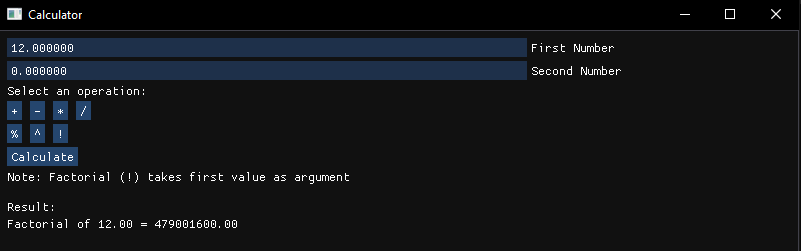
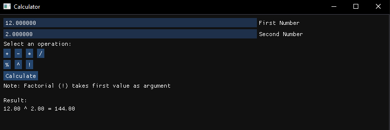

# Simple-Calculator

Calculator program was created using DearImGui and OpenGL 3.3 using C++.

Operations include addition, subtraction, multiplication, division, modulus (remainder operator), exponentials and factorial operator.

DearImGui: https://github.com/ocornut/imgui
